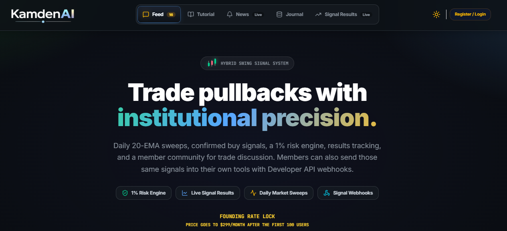

<div align="center">

# Stock Market Signal Automation

Build your own data-driven market edge with swing-trade signal webhooks, dashboards, alerts, AI agents, and automation examples.



<br />
<br />


</div>

This repo is a public starter kit for traders, builders, and developers who want to route stock market signal data into their own tools. It shows how to receive signal webhooks, verify webhook signatures, format alerts, log payloads, and build simple automations around signal events.

Live signal access is available through KamdenAI memberships at https://kamdenai.com. This repo uses sample data only.

## Why This Exists

Most trading signal products stop at alerts. This repo shows what becomes possible when signal data can move into your own workflow:

- send alerts to Discord, Slack, email, or SMS
- log every event into Google Sheets
- build private dashboards
- route signals into AI agents
- summarize daily setups automatically
- create personal trade review workflows
- connect supported broker workflow tools with manual approval
- store delivery logs for research and review

The signal engine stays private. The integration layer is public so members can build around it.

## What You Can Build

| Build | What It Does |
| --- | --- |
| Discord alert channel | Posts plan scans, confirmed buys, quick-exit results, and no-pick days into private channels |
| Google Sheets journal | Logs every signal, result, and delivery ID |
| Private dashboard | Displays active signals and historical performance examples |
| Make/Zapier workflow | Routes payloads into tools without writing code |
| AI agent summary | Converts raw signal payloads into plain-English trade notes |
| Broker workflow helper | Prefills or queues possible orders for human review |
| Research database | Stores payloads for later analysis and reporting |

## How It Works

KamdenAI publishes signal events during the trading day. A member can add an HTTPS webhook endpoint inside their account. When selected events are released, KamdenAI sends a JSON payload to that endpoint.

```text
KamdenAI signal release
  -> signed webhook delivery
  -> your HTTPS endpoint
  -> Discord / Sheets / dashboard / AI agent / workflow tools
```

Typical event schedule:

| Time | Event | Purpose |
| --- | --- | --- |
| 9:28 AM ET | `morning_scan.created` | Morning plan scan with entry, stop, target, and sizing context |
| 9:30 AM ET | `confirmed_buys.created` | Official top-two confirmed buys ranked by opening strength |
| 10:05 AM ET | `quick_exit_results.created` | Official morning quick-exit result for the confirmed-buy list |

If no picks qualify, the webhook can still send an event with an empty `confirmedBuys` or `quickExitResults` list. That lets your automation know the workflow ran successfully.

## Historical Example

The live product now uses a focused morning model: 9:28 plan, 9:30 top-two confirmation, and 10:05 quick-exit result. A public-safe historical notes page is included so builders can see how to structure result tracking without exposing private scan logic.

Read the assumptions and disclaimers in [Historical Account Examples](docs/historical-results.md). Past performance does not guarantee future results.

## Start Here

1. Read [Getting Started](docs/getting-started.md).
2. Review the [Webhook Events](docs/webhook-events.md).
3. Review the [Historical Account Examples](docs/historical-results.md).
4. Learn [Security and Signing](docs/security-and-signing.md).
5. Understand the [Architecture](docs/architecture.md).
6. Review the [Payload Field Reference](docs/payload-field-reference.md).
7. Pick a recipe from [Automation Recipes](docs/automation-recipes.md).
8. Run a local receiver:
   - [Node webhook receiver](examples/node-webhook-receiver/README.md)
   - [Python webhook receiver](examples/python-webhook-receiver/README.md)

## Example Payload

```json
{
  "event": "confirmed_buys.created",
  "dateKey": "2026-06-22",
  "sentAt": "2026-06-22T13:30:15.000Z",
  "data": {
    "confirmedBuys": [
      {
        "ticker": "SOFI",
        "name": "SoFi Technologies",
        "entry": 24.5,
        "stop": 23.95,
        "target": 25.6,
        "shares": 181,
        "riskDollars": 99.55,
        "openingConfirmation": {
          "status": "confirmed_buy",
          "statusLabel": "Top 1 confirmed buy",
          "entryDistanceR": 0.42,
          "windowEnd": "9:30 AM"
        }
      }
    ]
  }
}
```

See more examples in [examples/payloads](examples/payloads).

## Runnable Examples

| Example | Purpose |
| --- | --- |
| [Node webhook receiver](examples/node-webhook-receiver/README.md) | Receive and verify signed webhooks |
| [Python webhook receiver](examples/python-webhook-receiver/README.md) | Receive and verify signed webhooks with Flask |
| [Discord formatter](examples/discord-formatter/README.md) | Convert payloads into alert text |
| [AI prompt builder](examples/ai-agent-prompt-builder/README.md) | Turn payloads into AI-agent prompts |
| [Risk sizing calculator](examples/risk-sizing-calculator/README.md) | Model generic account risk sizing |
| [Simple dashboard](examples/simple-dashboard/README.md) | Paste payloads and preview a dashboard |
| [Google Sheets logger](examples/google-sheets-logger/README.md) | Plan a sheet-based signal log |

## Important Boundaries

This repo does not include:

- KamdenAI proprietary scan logic
- Internal scoring formulas
- Private infrastructure code
- Firebase configuration
- API keys
- Signing secrets
- Live paid signal data
- Guaranteed trading outcomes

This is a consumer-side starter kit. It teaches people how to receive, verify, route, and build around webhook data.

## Safety Notes

Trading involves risk. Signals, alerts, dashboards, and automation examples are educational tools. They are not financial advice and are not instructions to buy, sell, hold, short, or trade any security.

If you build broker-connected workflows, test in paper trading first, understand your broker API, add manual approval where appropriate, and never risk money you cannot afford to lose.

Read [DISCLAIMER.md](DISCLAIMER.md) before using or modifying these examples.

## Repo Structure

```text
assets/
  kamdenai-homepage.png
docs/
  ai-agents.md
  architecture.md
  automation-recipes.md
  broker-automation.md
  discord.md
  getting-started.md
  google-sheets.md
  historical-results.md
  launch-checklist.md
  make-com.md
  payload-field-reference.md
  security-and-signing.md
  troubleshooting.md
  webhook-events.md
examples/
  ai-agent-prompt-builder/
  csv-templates/
  discord-formatter/
  google-sheets-logger/
  node-webhook-receiver/
  payloads/
  python-webhook-receiver/
  risk-sizing-calculator/
  simple-dashboard/
templates/
  make-scenario-checklist.md
  webhook-consumer-checklist.md
```

## License

MIT. See [LICENSE](LICENSE).
