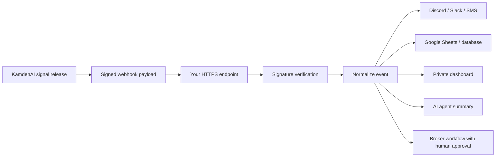

# Architecture

This repo focuses on the public integration layer around signal webhooks.

It does not expose KamdenAI's private signal generation logic, scoring rules, data provider setup, production infrastructure, or paid member data.

## Basic Flow



## Recommended Production Pattern

Use a small backend receiver between KamdenAI and your tools.

```text
Webhook receiver
  -> verifies signature
  -> rejects old timestamps
  -> stores delivery ID
  -> ignores duplicates
  -> saves raw payload
  -> sends normalized events to your tools
```

## Why Not Send Everything Directly To Every Tool?

No-code tools are great, but a receiver gives you:

- signature verification
- duplicate handling
- retries
- raw payload storage
- cleaner debugging
- one endpoint instead of many exposed URLs

## Safe Automation Layers

Start with alerts and logs first:

1. Receive webhook.
2. Verify delivery.
3. Send alert.
4. Log signal.
5. Review result.

Only after that should you consider more advanced workflows like broker API integration, and even then, use paper trading and manual approval.
